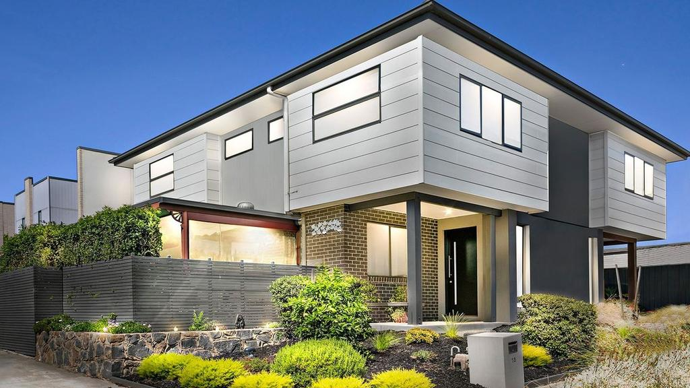

# Udacity Blockchain Capstone

The capstone will build upon the knowledge you have gained in the course in order to build a decentralized housing product.

## Welcome!
This project create a decentralized house listing service.

At present, property titles are often paper-based, creating opportunities for errors and fraud. Title professionals find defects in 25% of all titles during the transaction process, according to the American Land Title Association.

Any identified defect makes it illegal to transfer a property title to a buyer until it is rectified. This means property owners often incur high legal fees to ensure authenticity and accuracy of their property titles.

Moreover, title fraud poses a risk to homeowners worldwide. US losses associated with title fraud reportedly averaged around $103,000 per case in 2015, compelling many property buyers to purchase title insurance.

These title management issues could potentially be mitigated by using blockchain technology to build immutable digital records of land titles and using blockchain for transparent transactions. This approach could simplify property title management, making it more transparent and helping to reduce the risk of title fraud and the need for additional insurance.

Some companies and governments around the globe have already implemented blockchain technology for the title management process.

Ghanaian blockchain company Bitland has been working on a solution for Ghana, where it is estimated that almost 80% of land is unregistered, according to Forbes. Those that possess unregistered land find it more difficult to prove legal ownership, increasing their exposure to the risk of land seizures or property theft.

Bitland is seeking to create secure digital public records of ownership on its blockchain platform, with the aim of protecting land owners from title fraud. Bitland has expanded to operate in 7 African nations, India, and is also working with Native Americans in the US.

In this project you will be minting your own tokens to represent your title to the properties. Before you mint a token, you need to verify you own the property. You will use zk-SNARKs to create a verification system which can prove you have title to the property without revealing that specific information on the property. We covered the basics on zk-SNARKs in Privacy lesson in Course 5

Once the token has been verified you will place it on a blockchain market place (OpenSea) for others to purchase. Let's get started!

# Project Resources

* [Remix - Solidity IDE](https://remix.ethereum.org/)
* [Visual Studio Code](https://code.visualstudio.com/)
* [Truffle Framework](https://truffleframework.com/)
* [Ganache - One Click Blockchain](https://truffleframework.com/ganache)
* [Open Zeppelin ](https://openzeppelin.org/)
* [Interactive zero knowledge 3-colorability demonstration](http://web.mit.edu/~ezyang/Public/graph/svg.html)
* [Docker](https://docs.docker.com/install/)
* [ZoKrates](https://github.com/Zokrates/ZoKrates)
